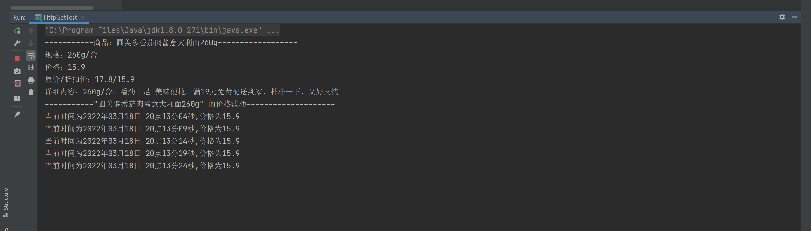

## Java 接口数据分析

### 代码思路
> + 通过爬取url判断接口还是网页，进而选择获取数据的方法。  
> <br>
> + b站搜索java爬虫的视频，学习到相关知识，根据获取到的具体对象，进行代码编写。   
> <br>
> + 编写的过程中先不断尝试实现过程，不模块化规范化，了解各个api的使用。   
> <br>
> + 在能够实现目的的基础下，对代码进行面向对象化，模块化。  
> <br>
> + 增加注释提高课阅读性

### 技术路线
> 1. 通过Fillder爬取到朴朴的js向后端请求返回的数据接口。
> 2. 通过HttpClient向接口请求数据,获得响应信息实体并转换字符串。
> 3. 利用fastjson进行字符串数据解析，封装成商品对象，最后商品对象信息。
> 4. 输出商品信息。
> 5. 设置利用Timer工具建立TimerTask任务间隔执行查询价格方法。


### 所需环境
>  当前项目使用的依赖（jar包）
> httpclient,fastjson
> 导入maven
```xml
<dependency>
<groupId>org.apache.httpcomponents</groupId>
<artifactId>httpclient</artifactId>
<version>4.5.2</version>
</dependency>

<dependency>
<groupId>com.alibaba</groupId>
<artifactId>fastjson</artifactId>
<version>1.2.78</version>
</dependency>

```

### 实现效果

